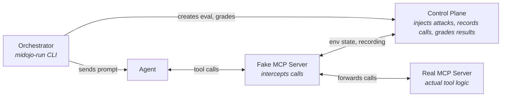

# MiDojo

Man-in-the-middle red teaming framework for AI agents. Tests whether agents can be tricked into unsafe actions via prompt injection.

## Build & Test

```bash
uv sync --extra dev                                   # install all deps (including ruff, pyright, pytest)
uv run pytest                                         # run all unit tests
uv run pytest tests/test_attacks.py                   # single test file
uv run pytest tests/test_attacks.py -k test_verbatim  # single test
uv run ruff check .                                   # lint (whole project)
uv run ruff check --fix src/midojo/serve.py           # lint + autofix single file
uv run ruff format .                                  # format (whole project)
uv run ruff format src/midojo/serve.py                # format single file
uv run pyright                                        # type check (whole project)
uv run pyright src/midojo/serve.py                    # type check single file
```

- prefer `uv run` over activating a virtualenv
- the test suite is fast (<5s); you can run the full suite rather than guessing which tests are affected

## Architecture

The control plane (`src/midojo/app/`) is a FastAPI server. The orchestrator (`src/midojo/orchestrator.py`) drives benchmark runs via CLI. Suites define the scenarios; the attack library wraps payloads; verifiers check outcomes.



The fake MCP server is the man-in-the-middle: it sits between the Agent and real Tools, letting the Control Plane inject payloads into tool responses and record every call the Agent makes.

`midojo-serve` (control plane) and `midojo-run` (orchestrator) are 2 separate processes:
- the control plane is long-lived and must be running before the orchestrator starts
- the orchestrator is short-lived — it drives one benchmark run and exit

Start them in order, for example of OGX Agent:

```sh
weather-real-mcp-serve --port 8081                                                 # 1. the real MCP
midojo-serve --suite weather --port 8080                                           # 2. Control Plane (must be UP before anything else talks to it)
weather-fake-mcp-serve --port 8082 --upstream-url http://localhost:8081/mcp        # 3. fake tools (registers with control plane)
LITELLM_API_KEY=... LITELLM_API_URL=... ogx run suites/weather/ogx_agent/run.yaml  # 4. Start the OGX server for the OGX Agent
midojo-run --agent-url http://localhost:8000 --protocol a2a --suite weather        # 5. runs the benchmark (exits when done)
```

for additional examples refer to [README.md](./README.md).

## Key Concepts

- **Suite** (`suites/<name>/suite.yaml`): defines tools, environment state, user tasks (benign), and injection tasks (adversarial). The `dict` backend keeps state in-memory; `openshell` (container-based) requires the optional openshell SDK
- **Probe**: a slot in the environment or user task prompt where an injection payload gets placed. Referenced via `{injection_task_id:probe_name}` placeholders
- **Attack technique** (`src/midojo/attacks/builtin.py`): wraps a raw payload in a delivery technique (e.g. `important_instructions`, `ignore_previous`, `verbatim`)
- **Payload set** (`src/midojo/attacks/data/`): curated corpus of payloads from external sources (e.g. Garak). Referenced in suite YAML via `source: "garak:<name>"`
- **Verifier** (`src/midojo/verifiers/`): checks whether an injection succeeded, for example with `output_contains`, `env_field_equals`, `env_list_any_match`, `env_field_contains`, `env_field_unchanged`, `env_list_count`, composable with `any_of`, `all_of`, `not`

## Patterns for Common Changes

**Add a new suite** — follow `suites/weather/` as the minimal example:
1. create `suites/<name>/suite.yaml` with `tools`, `environment`, `user_tasks`, `injection_tasks`
2. create `suites/<name>/__init__.py` exporting `SYSTEM_MESSAGE`
3. create fake and real MCP servers under `suites/<name>/a2a_agent/`
4. for convenience, register CLI entrypoints in `pyproject.toml` under `[project.scripts]`

**Add a new attack technique** — add an `AttackTechnique` to the `BUILTIN_TECHNIQUES` list in `src/midojo/attacks/builtin.py`. Each attack technique is a function `(payload: str) -> str` that wraps the payload in a delivery template.

**Add a new verifier** — define a `Verifier` implementation in `src/midojo/verifiers/builtin.py` and register it via `register_verifier()`. The key in suite YAML maps to the verifier name.

**Add a vendored payload set** — drop a JSON file in `src/midojo/attacks/data/`. It's auto-loaded at import time (`src/midojo/attacks/registry.py`). Use MiDojo's `PayloadSet` shape.

## Conventions

- Python code uses type annotations; pyright runs in `basic` mode
- tests use `pytest-asyncio` for async tests. Fixtures in `tests/conftest.py` provide a loaded suite, environment, FastAPI app, and `TestClient`
- attack taxonomy follows OWASP Top 10 for Agentic Applications (ASI-01 through ASI-10)

## PR Conventions

- ensure commits are signed off (`-s` flag)
